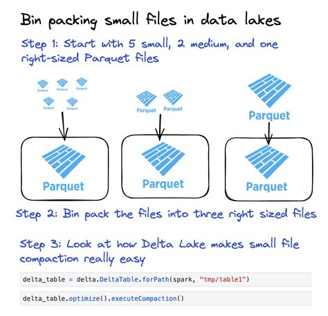

  

<h1 align="center">Delta Lake Optimizations – Microsoft Fabric Workshop</h1>

This repository is a step-by-step guide to understand **Delta Lake** and practice **performance optimizations** in a Microsoft **Fabric Lakehouse** (with Databricks notes where helpful).

## 📚 Contents
- [Overview – What & Why](docs/00-overview.md)  
- [Fabric Setup (UI only)](docs/01-setup-fabric.md)  
- [Hands-on Lab – Optimizations](docs/02-lab-optimizations.md)  
- [Databricks Appendix](docs/03-databricks-notes.md)

---

## 🔎 Who is this for?
Data engineers and analytics engineers who want a practical understanding of **how Delta tables behave over time** and **how to keep them performant**.

## 🧩 Topics Covered
- `OPTIMIZE` (bin-packing)
- `V-Order` (Fabric) and `Z-Order`
- `VACUUM` and Time Travel
- Table History
- Partitioning strategies
- `cache()` and `persist()` for Spark
- Schema definition vs `inferSchema`

---

## 🔎 Visual Overview

   
  <i>From many small files to fewer, larger files with OPTIMIZE</i>

---

## 🧰 Prerequisites

To complete this workshop, you will need:

- **Microsoft Fabric capacity** – either a Fabric trial (F-SKU capacity) or a paid capacity-enabled workspace.
- **Workspace permissions** to create Lakehouses and Notebooks.
- **Basic familiarity with Python / PySpark** – you should be comfortable running code cells and reading basic DataFrame operations.
- **Basic understanding of Delta Lake tables** – this guide will introduce the concepts, but some knowledge of tables and SQL is assumed.

> 💡 If you are new to Fabric, check out [Get started with Microsoft Fabric](https://learn.microsoft.com/en-us/training/paths/get-started-fabric/) before beginning this lab.

---

## 🚀 How to Start
1. Read the [Overview](docs/00-overview.md) to understand Delta Lake concepts.
2. Follow [Setup Guide](docs/01-setup-fabric.md) to prepare your Lakehouse and Notebook.
3. Open [Hands-on Lab](docs/02-lab-optimizations.md) and execute step by step.

---

## 📝 Notes
- In Fabric, **V-Order is off by default** in new workspaces and can be enabled per session, per table, or during `OPTIMIZE`.
- Default `VACUUM` retention in Fabric is **7 days**.

---

## 📌 Maintainer
Maintained by [@memomsft](https://github.com/memomsft).  
Suggestions and feedback are welcome — open an Issue or reach out on Teams.

