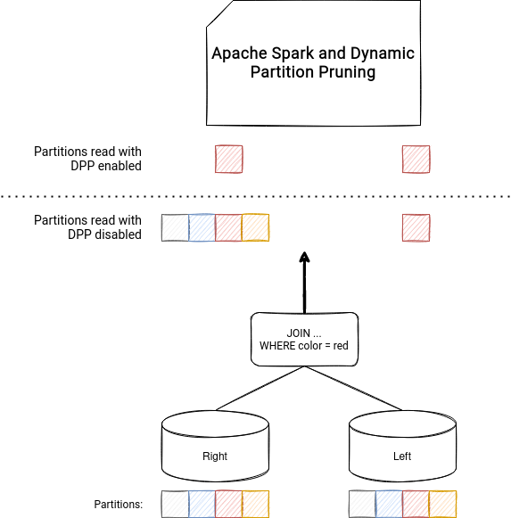

# 02 — Hands-on Lab: Delta Optimizations

## 🏁 Before You Start

To complete this lab, you will need:

- A **Microsoft Fabric workspace** with a Lakehouse created (see [Setup Guide](01-setup-fabric.md)).
- A **Notebook** attached to that Lakehouse with default language set to **PySpark**.
- Enough capacity for data generation (recommended: F4 or higher).
- Optionally adjust `N_ROWS` and `N_PARTS` if running in small capacity workspaces.

This lab introduces the most important **Delta Lake performance and maintenance concepts** and gives you a chance to experiment with them step by step in Microsoft Fabric.

---

## A. Generate Sample Data

We start by creating a synthetic dataset with **many small files**, which is a common performance issue in data lakes.  
Small files increase metadata overhead and slow down queries — this is exactly what `OPTIMIZE` solves.


```python
from pyspark.sql.types import *
import pyspark.sql.functions as F

N_ROWS = 5_000_000
N_PARTS = 400
DATA_PATH = "Tables/sales"

schema = StructType([
    StructField("order_id", LongType(), False),
    StructField("order_ts", TimestampType(), False),
    StructField("customer_id", IntegerType(), False),
    StructField("country", StringType(), False),
    StructField("category", StringType(), False),
    StructField("price", DoubleType(), False),
    StructField("quantity", IntegerType(), False),
    StructField("total", DoubleType(), False),
    StructField("status", StringType(), False),
])

countries = ["US","CA","MX","UK","DE","FR","ES","BR","IN","JP"]
cats      = ["electronics","apparel","home","grocery","toys","sport"]
statuses  = ["paid","shipped","delivered","returned","cancelled"]

df = (spark.range(N_ROWS)
      .withColumn("order_id", F.col("id"))
      .withColumn("order_ts", F.expr("timestamp'2024-01-01 00:00:00' + interval (cast(rand()*300 as int)) day"))
      .withColumn("customer_id", (F.rand()*100000).cast("int"))
      .withColumn("country", F.element_at(F.array(*[F.lit(c) for c in countries]), (F.rand()*len(countries)+1).cast("int")))
      .withColumn("category", F.element_at(F.array(*[F.lit(c) for c in cats]), (F.rand()*len(cats)+1).cast("int")))
      .withColumn("price", (F.rand()*400+5).cast("double"))
      .withColumn("quantity", (F.rand()*5+1).cast("int"))
      .withColumn("total", F.col("price")*F.col("quantity"))
      .withColumn("status", F.element_at(F.array(*[F.lit(s) for s in statuses]), (F.rand()*len(statuses)+1).cast("int")))
      .drop("id"))

(df.repartition(N_PARTS)
   .write.format("delta").mode("overwrite")
   .option("overwriteSchema", "true")
   .save(DATA_PATH))
```

Register as table

```sql

%%sql
CREATE TABLE IF NOT EXISTS sales
USING DELTA
LOCATION 'Tables/sales';

```

---

## B. Baseline Measurements

Before optimizing, it’s important to measure performance so we can compare later.  
We will measure two things:

1. **Full table scan** – how long it takes to count all rows.  
2. **Selective filter** – how long it takes to count only rows where `country='US' AND category='electronics'`.

Run the following code:

```python
import time

def timed(f):
    t0 = time.time()
    out = f()
    dt = time.time() - t0
    print(f"⏱ {dt:0.2f}s")
    return out

# Warm-up (loads data once so we don’t measure cluster spin-up time)
spark.table("sales").count()

# Full table scan
timed(lambda: spark.table("sales").count())

# Selective filter
timed(lambda: spark.table("sales").where("country='US' AND category='electronics'").count())

```

Take note of the execution times printed in the output (for example: ⏱ 8.52s).
Later, you will run these same queries again after OPTIMIZE and Z-ORDER to compare performance improvements.

---

## C. OPTIMIZE, V-Order & Z-Order

**OPTIMIZE** is Delta's *bin-packing* process — it merges many small files into fewer larger ones, improving read efficiency.

- **V-Order** (Fabric only): optimizes column order & Parquet layout for faster scans.
- **Z-Order**: physically co-locates rows with similar column values, reducing data read for common filters.

Use `OPTIMIZE ... VORDER` to compact files, and optionally add `ZORDER BY (...)` to improve query selectivity performance.

```sql

%%sql
OPTIMIZE sales VORDER;

OPTIMIZE sales
ZORDER BY (country, category)
VORDER;

```

<p align="center">
  
  
</p>

<p align="center">
<b>Left:</b> Z-Order clusters rows across files, reducing the number of files scanned.<br>
<b>Right:</b> V-Order optimizes layout within files, improving columnar compression and read performance.
</p>

After running OPTIMIZE, re-run the **Baseline Measurements** section from above to compare execution times before vs. after.
You should notice faster scans, especially on selective filters (country='US' AND category='electronics').

---

## D. Table History & Time Travel

Delta Lake keeps a transaction log (`_delta_log`) with every commit which is part of the **ACID transactions** capabilities (Atomicity, Consistency, Isolation, Durability), meaning every write operation is fully consistent and logged. This allows you to travel back to previous versions of a table if something goes wrong.

You can query table **history** to audit operations or understand how data changed over time.

**Time Travel** lets you query data as it was at:
- A specific **version number**
- A specific **timestamp**

Useful for debugging, reproducing ML training datasets, or auditing compliance snapshots.

```sql

%%sql
DESCRIBE HISTORY sales;

SELECT COUNT(*) FROM sales VERSION AS OF 0;

```

In order to test this time travel feature, let's now simulate a mistake in the data. For example we will delete some rows as an accidental operation:

```sql

%%sql
DELETE FROM sales WHERE country = 'US';

```

Verify the count after our delete

```sql

%%sql
SELECT COUNT(*) FROM sales;

```

Let's view the table history again, you will see a new `DELETE` entry with a higher version:

```sql

%%sql
DESCRIBE HISTORY sales;

```

Let's query the table as of the version before the delete operation

```sql
%%sql
SELECT COUNT(*) FROM sales VERSION AS OF <previous_version_number>;
```

We can see that there are more rows as this is the original version. So, let's restore the table to the earlier state by replacing its contents with the previous content:

```sql

%%sql
CREATE OR REPLACE TABLE sales
AS SELECT * FROM sales VERSION AS OF <previous_version_number>;

```


Now, let's verify the row count is back to normal:

```sql
%%sql
SELECT COUNT(*) FROM sales;
```

This exercise demonstrates how table history and time travel can be used to recover from accidental deletes or updates without requiring a full restore from backups like in traditional analytic solutions.

---

## E. VACUUM

> ⚠️ **Important:** `VACUUM` permanently deletes files no longer referenced by the Delta log. Run only in a **lab/test environment** unless retention requirements are known.

VACUUM removes old, unreferenced files that are no longer needed by the Delta log.  
This frees up storage, but also **limits how far back you can time travel**.

- **Default retention**: 7 days in Fabric.
- Always run `DRY RUN` first to see what would be deleted.

```sql

%%sql
VACUUM sales DRY RUN;

VACUUM sales RETAIN 168 HOURS;

```

---

## F. Partitioning Strategies

Partitioning divides data into subfolders by a column value (e.g. `country=US/`).  
It allows Spark to **prune** unnecessary partitions when filtering — speeding up reads.





Best practices:
- Choose **low/medium cardinality** columns.
- Don’t over-partition — too many small partitions = too many small files.
- Combine partitioning with Z-Order for additional selective filters.

```python
(spark.table("sales")
 .repartition("country")
 .write.format("delta").mode("overwrite")
 .option("overwriteSchema","true")
 .save("Tables/sales_by_country"))

spark.sql("""
CREATE OR REPLACE TABLE sales_by_country
USING DELTA LOCATION 'Tables/sales_by_country'
""")

spark.sql("SELECT COUNT(*) FROM sales_by_country WHERE country='US'").show()

```

---

## G. Cache / Persist

Spark will recompute a DataFrame each time it is referenced, unless you **cache** or **persist** it.

- `cache()` is simply a shorthand for `persist(StorageLevel.MEMORY_AND_DISK)` — it stores the DataFrame in memory if possible, and spills to disk if needed.
- `persist()` allows more granular control, e.g., only memory, memory+disk, serialized, or even off-heap.

| Method | When to Use | Trade-offs |
|-------|-------------|-----------|
| **cache()** | Default option when you just need to reuse a DataFrame multiple times in the same notebook. | Easiest to use, stores in memory+disk. |
| **persist(level)** | When you need specific storage level control (e.g., MEMORY_ONLY for super-fast small datasets, DISK_ONLY for very large). | Gives control but requires you to choose level manually. |

Always call `unpersist()` when done to free resources.

```python
df_us_elec = spark.table("sales").where("country='US' AND category='electronics'").cache()
df_us_elec.count()
df_us_elec.unpersist()

```

---

## H. Schema Definition vs InferSchema

Letting Spark infer the schema (`inferSchema=true`) forces a full file scan to detect column types — this is slow for large datasets.

Defining the schema manually:
- Avoids an extra scan.
- Guarantees correct column types.
- Improves job startup times.

```python
from pyspark.sql.types import *

orders_schema = StructType([
  StructField("order_id", LongType()),
  StructField("order_ts", TimestampType()),
  StructField("country", StringType()),
  StructField("category", StringType()),
  StructField("price", DoubleType()),
  StructField("quantity", IntegerType())
])

df = spark.read.schema(orders_schema).csv("Files/raw/*.csv")

```

---

## 🏁 Summary

By the end of this lab you will have:
- Reduced the number of small files using `OPTIMIZE`.
- Verified performance improvements with V-Order and Z-Order.
- Learned to check table history and use time travel.
- Cleaned up old files with `VACUUM`.
- Experimented with partitioning strategies.
- Applied caching, persistence, and schema definition for performance.


---

## 📚 Learn More

- [Delta Lake documentation](https://docs.delta.io/latest/index.html)
- [Microsoft Fabric – Lakehouse table maintenance](https://learn.microsoft.com/fabric/data-engineering/lakehouse-optimize-vacuum)
- [V-Order write optimization in Fabric](https://learn.microsoft.com/fabric/data-engineering/v-order)
- [OPTIMIZE and Z-Order in Fabric](https://learn.microsoft.com/fabric/data-engineering/optimize-zorder)

> 💡 You can run `DESCRIBE DETAIL sales` to see current table properties including V-Order default setting.
