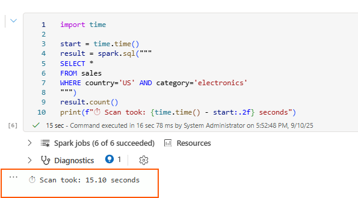
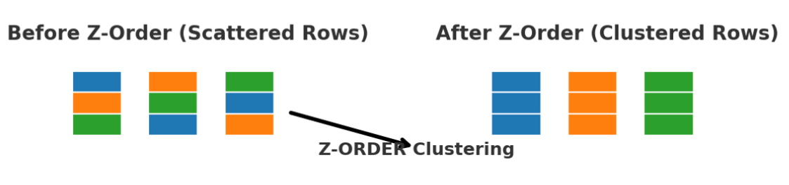

# 02 — Hands-on Lab: Delta Optimizations

## 🏁 Before You Start

To complete this lab, you will need:

- A **Microsoft Fabric workspace** with a Lakehouse created (see [Setup Guide](01-setup-fabric.md)).
- A **Notebook** attached to that Lakehouse with default language set to **PySpark**.
- Enough capacity for data generation (recommended: F4 or higher).
- Optionally adjust `N_ROWS` and `N_PARTS` if running in small capacity workspaces.

This lab introduces the most important **Delta Lake performance and maintenance concepts** and gives you a chance to experiment with them step by step in Microsoft Fabric.

---

## A. Generate Sample Data

We start by creating a synthetic dataset with **many small files**, which is a common performance issue in data lakes.  
Small files increase metadata overhead and slow down queries — this is exactly what `OPTIMIZE` solves.


```python

from pyspark.sql.types import *
import pyspark.sql.functions as F

# -------------------------------
# 1. Define schema & table path
# -------------------------------
N_ROWS = 5_000_000
N_PARTS = 400
DATA_PATH = "Tables/sales"

schema = StructType([
    StructField("order_id", LongType(), False),
    StructField("order_ts", TimestampType(), False),
    StructField("customer_id", IntegerType(), False),
    StructField("country", StringType(), False),
    StructField("category", StringType(), False),
    StructField("price", DoubleType(), False),
    StructField("quantity", IntegerType(), False),
    StructField("total", DoubleType(), False),
    StructField("status", StringType(), False),
])

# -------------------------------
# 2. Generate sample data
# -------------------------------
countries = ["US","CA","MX","UK","DE","FR","ES","BR","IN","JP"]
cats      = ["electronics","apparel","home","grocery","toys","sport"]
statuses  = ["paid","shipped","delivered","returned","cancelled"]


df = (spark.range(N_ROWS)
      .withColumn("order_id", F.col("id"))
      .withColumn("order_ts", F.date_add(F.lit("2024-01-01"), (F.rand()*300).cast("int")))
      .withColumn("order_ts", F.col("order_ts").cast("timestamp"))
      .withColumn("customer_id", (F.rand()*100000).cast("int"))
      .withColumn("country", F.element_at(F.array(*[F.lit(c) for c in countries]), (F.rand()*len(countries)+1).cast("int")))
      .withColumn("category", F.element_at(F.array(*[F.lit(c) for c in cats]), (F.rand()*len(cats)+1).cast("int")))
      .withColumn("price", (F.rand()*400+5).cast("double"))
      .withColumn("quantity", (F.rand()*5+1).cast("int"))
      .withColumn("total", F.col("price")*F.col("quantity"))
      .withColumn("status", F.element_at(F.array(*[F.lit(s) for s in statuses]), (F.rand()*len(statuses)+1).cast("int")))
      .drop("id"))

# -------------------------------
# 3. Write data into the table
# -------------------------------
(df.repartition(N_PARTS)
   .write.format("delta")
   .mode("overwrite")
   .option("overwriteSchema", "true")
   .save(DATA_PATH))

```


---

## B. Baseline Measurements

Before optimizing, it’s important to measure performance so we can compare later.  
We will measure two things:

1. **Full table scan** – how long it takes to count all rows.  
2. **Selective filter** – how long it takes to count only rows where `country='US' AND category='electronics'`.

Run the following code:

```python

import time

start = time.time()
result = spark.sql("""
SELECT *
FROM sales
WHERE country='US' AND category='electronics'
""")
result.count()
print(f"⏱ Baseline scan took: {time.time() - start:.2f} seconds")


```

Take note of the execution times printed in the output (for example: ⏱ 8.52s).
Later, you will run these same queries again after OPTIMIZE VORDER to compare performance improvements.



---

## C. OPTIMIZE, V-Order & Z-Order

**OPTIMIZE** is Delta's *bin-packing* process — it merges many small files into fewer larger ones, improving read efficiency.

- **V-Order** (Fabric only): optimizes column order & Parquet layout for faster scans.
- **Z-Order**: physically co-locates rows with similar column values, reducing data read for common filters. (Only applicable on Databricks)

Use `OPTIMIZE ... VORDER` to compact files, and optionally add `ZORDER BY (...)` to improve query selectivity performance.


Let's check that OPTIMIZE is not enabled at table level first by checking the table properties

```sql

%%sql
DESCRIBE EXTENDED sales

```
It seems is not explictly enabled as there is no VORDER property populated


```sql

%%sql
OPTIMIZE sales VORDER;

--Optional (this is more for Databricks)
--OPTIMIZE sales
--#ZORDER BY (country, category)
--#VORDER;

```
If we run `DESCRIBE EXTENDED sales` again it will show that now **VORDER is enabled** at table level which means its optimized.


| Z-Order | V-Order |
|--------|---------|
|  |  |


<p align="center">
<b>Left:</b> Z-Order clusters rows across files, reducing the number of files scanned.<br>
<b>Right:</b> V-Order optimizes layout within files, improving columnar compression and read performance.
</p>


After running OPTIMIZE, re-run the **Baseline Measurements** section from above to compare execution times before vs. after.
You should notice faster scans, especially on selective filters (country='US' AND category='electronics').

Let's run the baseline measurement cell again to compare the results, but now let's clear the Spark Session cache first.

```python

spark.catalog.clearCache()

import time
start = time.time()
result = spark.sql("""
SELECT *
FROM sales
WHERE country='US' AND category='electronics'
""")
result.count()
print(f"⏱ Baseline scan took: {time.time() - start:.2f} seconds")

```


---

## D. Table History & Time Travel

Delta Lake keeps a transaction log (`_delta_log`) with every commit which is part of the **ACID transactions** capabilities (Atomicity, Consistency, Isolation, Durability), meaning every write operation is fully consistent and logged. This allows you to travel back to previous versions of a table if something goes wrong.

You can query table **history** to audit operations or understand how data changed over time.

**Time Travel** lets you query data as it was at:
- A specific **version number**
- A specific **timestamp**

Useful for debugging, reproducing ML training datasets, or auditing compliance snapshots.

Let's check the history of our table with `DESCRIBE HISTORY` which will give us the operations on this table over time. Then, we will count the records on this table as of the version 0 back from we performed the initial writing as per the historical output.

```sql

%%sql
DESCRIBE HISTORY sales;

SELECT COUNT(*) FROM sales VERSION AS OF 0;

```


In order to test this time travel feature, let's now simulate a mistake in the data. For example we will delete some rows as an accidental operation:

```sql

%%sql
DELETE FROM sales WHERE country = 'US';

```

Verify the count after our delete

```sql

%%sql
SELECT COUNT(*) FROM sales;

```


Let's view the table history again, you will see a new `DELETE` entry with a higher version (3):

```sql

%%sql
DESCRIBE HISTORY sales;

```


Let's query the table as of the version before the delete operation

```sql
%%sql
SELECT COUNT(*) FROM sales VERSION AS OF 2; -- in this case is the version 2, the one where we setup VORDER
```


We can see that there are more rows as this is previous version before the deletion. So, let's restore the table to this earlier version by using the time travel feature:

```sql

%%sql
CREATE OR REPLACE TABLE sales
AS SELECT * FROM sales VERSION AS OF 2;

```


Now, let's verify the row count is back to normal:

```sql
%%sql
SELECT COUNT(*) FROM sales;

DESCRIBE HISTORY sales;

```

Now we can see the original number of rows before the deletion and also the newer version of this table (version 4) shows the table replacement we just did


This exercise demonstrates how table history and time travel can be used to recover from accidental deletes or updates without requiring a full restore from backups like in traditional analytic solutions.

---

## E. VACUUM

> ⚠️ **Important:** `VACUUM` permanently deletes files no longer referenced by the Delta log. Run only in a **lab/test environment** unless retention requirements are known.

VACUUM removes old, unreferenced files that are no longer needed by the Delta log.  
This frees up storage, but also **limits how far back you can time travel**.

- **Default retention**: 7 days in Fabric.
- Always run `DRY RUN` first to see what would be deleted.

```sql

%%sql
VACUUM sales DRY RUN;

VACUUM sales RETAIN 168 HOURS;

```

---

## F. Partitioning Strategies

Partitioning divides data into subfolders by a column value (e.g. `country=US/`).  
It allows Spark to **prune** unnecessary partitions when filtering — speeding up reads.


**✅ When to Partition**

Partitioning is most beneficial when:

- Large tables (typically millions+ rows, multiple GBs).
- Queries frequently filter on a single column (e.g., WHERE country = 'US').
- Column has low-to-moderate cardinality:

✅ Good: country, region, year, month, status

❌ Bad: customer_id, order_id, timestamp (too many partitions)

**⚠️ When Not to Partition**

**Avoid partitioning when:**

- The table is small (less than a few hundred MBs).
- Partition column has very high cardinality (hundreds of thousands/millions of distinct values).
- You query across all partitions most of the time (no benefit, extra overhead).
- You mostly do aggregations across partitions (overhead > benefit).

**🔑 Partition Sizing Guidelines**

- Target files of ~128–512 MB per partition after compaction/OPTIMIZE.
- Avoid having too many small files — you can end up with "over-partitioning".
- Ideal number of partitions:
- At least a few MBs per partition
- At most a few thousand partitions per table


Let's put this on practice by partitioning our existing sales data by the column `country` and generate a new table name `sales_by_country`

```python
# 1️⃣ Write the partitioned Delta table
(spark.table("sales")
 .write.format("delta")
 .mode("overwrite")
 .option("overwriteSchema", "true")
 .partitionBy("country")
 .save("Tables/sales_by_country"))

# 2️⃣ Register the table from its Delta location
spark.sql("""
CREATE TABLE IF NOT EXISTS sales_by_country
USING DELTA
LOCATION 'Tables/sales_by_country'
""")

# 3️⃣ Verify partitioning
spark.sql("DESCRIBE DETAIL sales_by_country").select("partitionColumns").show(truncate=False)

# 4️⃣ Query with partition pruning
spark.sql("""
SELECT COUNT(*)
FROM sales_by_country
WHERE country = 'US'
""").show()


```


Also, if we take a look at the underlying parquet files, now we can see that we have multiple folders, one per partition (country)


We can also query this table using the partition definition in the subsequent Spark read operations allowing for deterministic scanning also if needed.


---

## G. Cache / Persist

**🧠 Understanding cache() and persist() in Spark**

By default, Spark builds a logical plan for each DataFrame.
Whenever you re-use that DataFrame in multiple actions (e.g., .count(), .show(), .write()), Spark recomputes it from scratch — scanning the source, applying filters, joins, and transformations again.

This can be expensive for big datasets.

**✅ Why Use Cache / Persist**

Caching lets Spark store the results of a DataFrame in memory (and optionally disk), so future actions reuse the stored data instead of recomputing.

- `cache()` is simply a shorthand for `persist(StorageLevel.MEMORY_AND_DISK)` — it stores the DataFrame in memory if possible, and spills to disk if needed.
- `persist()` allows more granular control, e.g., only memory, memory+disk, serialized, or even off-heap.

| Method | When to Use | Trade-offs |
|-------|-------------|-----------|
| **cache()** | Default option when you just need to reuse a DataFrame multiple times in the same notebook. | Easiest to use, stores in memory+disk. |
| **persist(level)** | When you need specific storage level control (e.g., MEMORY_ONLY for super-fast small datasets, DISK_ONLY for very large). | Gives control but requires you to choose level manually. |

Always call `unpersist()` when done to free resources.

**📌 When Caching is Useful**

- Iterative algorithms (ML training loops, aggregations on the same dataset).
- Exploratory data analysis where you run many queries on the same DataFrame.
- Multiple actions on the same transformation chain:

```python
  df = (spark.read.format("delta").load("Tables/sales")
        .filter("country='US'")
        .withColumn("total", F.col("price") * F.col("quantity")))

df.cache()  # avoids recomputation below

print(df.count())   # Action 1
display(df.groupBy("category").count())  # Action 2
```

- Checkpointing intermediate results before expensive operations like joins.

**⚠️ When Not to Cache**

- If you only use the DataFrame once.
- If the dataset is too large to fit in memory and you risk evicting other important data.
- If your cluster has limited resources — caching can actually slow things down by causing memory pressure and spilling.


Let's put some of these concepts into practice:

```python
import time

df = spark.table("sales").filter("country='US'")

# Without cache
start = time.time()
df.count()
print(f"⏱ First count (no cache): {time.time()-start:.2f}s")

# Cache it
df.cache()
df.count()  # materializes the cache

# Second action should be faster
start = time.time()
df.count()
print(f"⏱ Second count (cached): {time.time()-start:.2f}s")


```

Notice that the second count runs much faster — proving the effect of caching.


Finally let's UNPERSIST the dataframe from cache to free up resources by executing **unpersist** on your dataframe --> df.unpersist()`

---

## H. Schema Definition vs InferSchema

Letting Spark infer the schema (`inferSchema=true`) forces a full file scan to detect column types — this is slow for large datasets.

Defining the schema manually:
- Avoids an extra scan.
- Guarantees correct column types.
- Improves job startup times.

```python
from pyspark.sql.types import *

orders_schema = StructType([
  StructField("order_id", LongType()),
  StructField("order_ts", TimestampType()),
  StructField("country", StringType()),
  StructField("category", StringType()),
  StructField("price", DoubleType()),
  StructField("quantity", IntegerType())
])

df = spark.read.schema(orders_schema).csv("Files/raw/*.csv")

```

---

## 🏁 Summary

By the end of this lab you will have:
- Reduced the number of small files using `OPTIMIZE`.
- Verified performance improvements with V-Order and Z-Order.
- Learned to check table history and use time travel.
- Cleaned up old files with `VACUUM`.
- Experimented with partitioning strategies.
- Applied caching, persistence, and schema definition for performance.


---

## 📚 Learn More

- [Delta Lake documentation](https://docs.delta.io/latest/index.html)
- [Microsoft Fabric – Lakehouse table maintenance](https://learn.microsoft.com/fabric/data-engineering/lakehouse-optimize-vacuum)
- [V-Order write optimization in Fabric](https://learn.microsoft.com/fabric/data-engineering/v-order)
- [OPTIMIZE and Z-Order in Fabric](https://learn.microsoft.com/fabric/data-engineering/optimize-zorder)

> 💡 You can run `DESCRIBE DETAIL sales` to see current table properties including V-Order default setting.
